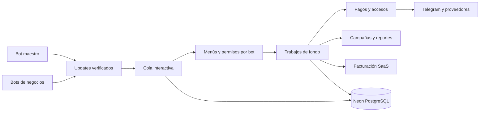

# Arquitectura de la plataforma Telegram

## Proceso y responsabilidades

`polling.py` coordina lectores por token, consumidores de cola y mantenimiento. El modo actual no inicia FastAPI ni Redis. `runtime.py` comparte clientes HTTP persistentes, proveedores, cifrado y conexiones SQL. El listener opcional de `ingress.py` recibe únicamente confirmaciones cuando se habilita una URL HTTPS.

## Aislamiento

Las tablas operativas incluyen `tenant_id`, RLS forzada y claves foráneas compuestas. Las operaciones de consola verifican además `bot_id`, incluso entre dos bots del mismo propietario. Canales, ofertas, planes, pagos, comprobantes y credenciales se resuelven bajo ese contexto. Un administrador de un bot no hereda automáticamente acceso a otro.

El rol `platform_api` es limitado y no puede acceder a sesiones privadas, botones, cursores o ajustes globales, ni escribir directamente los libros financieros y sus historiales. El rol de sistema se reserva para los procesos de confianza. Las consultas del superadministrador son explícitas y auditadas.

OWNER, ADMIN, SUPPORT, FINANCE, MODERATOR y CUSTOM delimitan funciones. Nadie puede otorgar permisos que no tiene, salvo el propietario autorizado de la plataforma. Las acciones sensibles vuelven a comprobar permisos al ejecutar un trabajo o entregar un reporte.

## Persistencia e idempotencia

Los updates, offsets, formularios, navegación, botones y trabajos persisten en PostgreSQL. Los botones son opacos, caducan, pertenecen a actor y bot y solo se consumen una vez. El texto privado entrante se cifra en tránsito dentro de la cola y se descarta al completar su procesamiento.

La deduplicación usa índices únicos e inserciones `ON CONFLICT`, bloqueos de filas en operaciones financieras y claves de idempotencia de los proveedores. Los reembolsos bloquean primero pago y después cargo, evitando un orden de bloqueo contradictorio.

Los trabajos se separan en colas interactivas y de fondo. Cada tenant recibe turnos y los mensajes de una conversación mantienen orden. Los trabajos con arrendamiento vencido pueden recuperarse; el trabajo se bloquea durante su ejecución. Una entrega de Telegram incierta se registra como `DELIVERY_UNKNOWN`; no se vuelve a enviar ciegamente.

## Módulos comerciales

- `connections`: alta, token, validación, sustitución y desconexión.
- `business`: planes, canales comprados, historial, permisos e invitaciones.
- `billing_ledger`: ciclos, tasas históricas, conversiones, facturas, liquidaciones y concesiones.
- `payment_methods`, `external_payments`, `receipts`, `refunds`: medios del negocio, firmas, revisión y devoluciones.
- `growth`: audiencias SQL, instantánea de destinatarios y envío por lotes.
- `reporting`, `notifications`: estadísticas transaccionales, CSV cifrado y resúmenes programados.
- `console_*`, `i18n`, `ui_catalog`: diálogos, menús y textos compartidos.

## Evolución

La migración `0005` añade el modelo comercial, índices y políticas. Conserva pagos, fechas, canales y claves cifradas; importa ventas anteriores con comisión cero, evita reutilizar pruebas y asigna administradores existentes a sus bots. Una reversión financiera destructiva no es automática: se utiliza una copia verificada.

El diseño identifica trabajos y servicios por tenant y bot para particionar consumidores en el futuro. La instancia pequeña actual no representa un despliegue para miles de bots. Polling requiere un único lector por token; para crecer se necesita medir carga, pasar a webhooks y ampliar consumidores y límites de base sin perder idempotencia.
