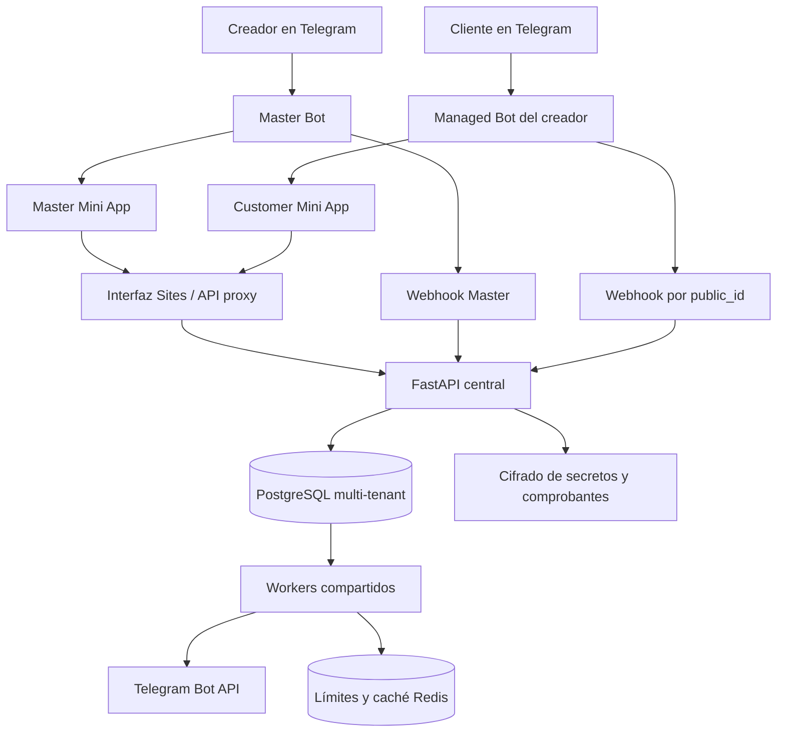
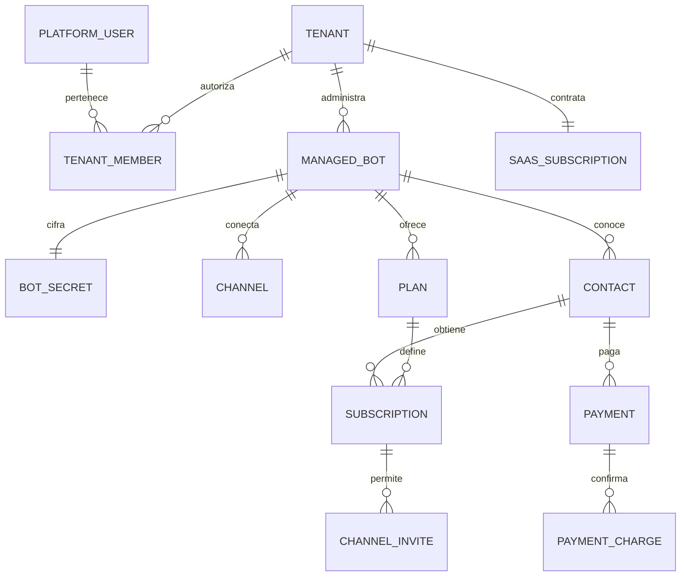
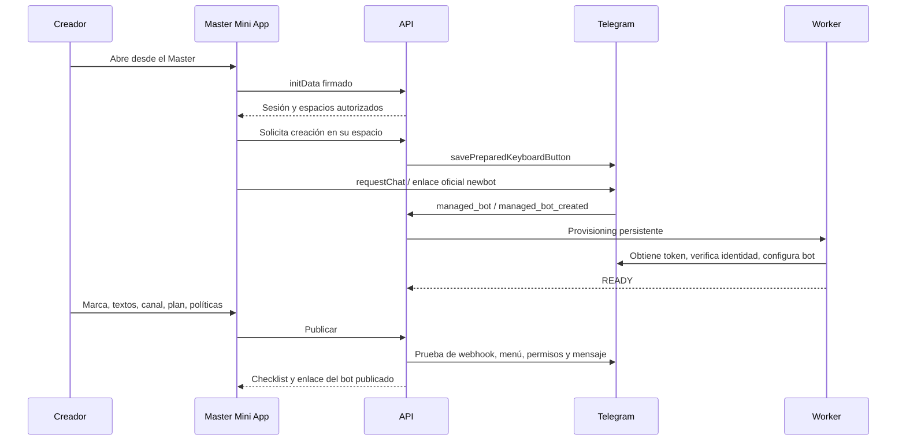

# Arquitectura A–K

Decisiones presentadas antes de programar y concretadas en esta implementación. Versión inicial 0.1.0.

## A. Stack

Python/FastAPI para una API central, SQLAlchemy 2 y Alembic para PostgreSQL, Redis para límites distribuidos y caché, y workers con trabajos persistentes en PostgreSQL. React 19/TypeScript con Sites y componentes shadcn para las dos Mini Apps. SQLite se limita al desarrollo y a pruebas rápidas.

La cola y el outbox viven junto a los cambios de negocio: así una confirmación de pago y su trabajo de acceso se confirman en una misma transacción. Se evita depender de una publicación Redis separada que pudiera perderse después del commit.

## B. Arquitectura

Un bot es una fila de identidad y configuración, nunca una copia de código. El API y los workers se pueden replicar; todos comparten PostgreSQL, Redis y el almacenamiento de comprobantes. El almacenamiento local cifrado requiere un volumen compartido entre réplicas; un adaptador de objetos es una evolución posterior.

## C. Modelo de datos

47 tablas de aplicación, 42 con `tenant_id`. El DDL reproducible está en [schema-postgres.sql](schema-postgres.sql). `alembic_version` es una tabla adicional del migrador.

| Área | Entidades principales |
|---|---|
| Identidad | PlatformUser, Tenant, TenantMember, AuthSession, Onboarding |
| Bots | BotCreationRequest, ManagedBot, BotSecret, BotSettings, BotText |
| Comercio | Channel, Plan, PlanPrice, ProviderConfig, Payment, PaymentCharge, PaymentAttempt, BankReceipt, Subscription, ChannelInvite |
| CRM | Contact, Conversation, Message, InternalNote, Tag, ContactTag, CRMTask |
| Crecimiento | Campaign, CampaignRecipient, AutomationRule, AutomationExecution, Coupon, CouponRedemption, Referral, AttributionLink |
| Infraestructura | Event, Job, TelegramUpdate, ProviderEvent, AuditLog |
| Plataforma | SaaSPlan, SaaSSubscription, SaaSInvoice, SaaSCharge, FeatureFlag, UsageCounter, PlatformSupportTicket |

## D. Flujo

## E. Managed Bots

Se comprueba la capacidad del Master. Las credenciales del child se obtienen únicamente en el servidor. La solicitud pendiente se correlaciona con el propietario que Telegram certifica, sin confiar en un tenant suministrado por el cliente. Existe una solicitud vigente por creador.

Un cambio de propietario pone el bot en `OWNERSHIP_CHANGED` y lo despublica. Sus contactos, pagos y secretos no se trasladan al nuevo dueño. La rotación guarda el nuevo token cifrado antes de reconfigurar el webhook; los reintentos posteriores recuperan el token actual en lugar de volver a rotarlo.

## F. Webhook multi-bot

`/telegram/webhook/master` recibe al Master; `/telegram/webhook/{public_id}` resuelve la identidad del child por un índice único. El token nunca aparece en la ruta. Se verifica el secret header, se deduplica por bot/update y se persiste un trabajo. El pre-checkout se resuelve por una ruta inmediata para respetar el plazo de Telegram, sin esperar detrás de campañas.

La resolución por ID se probó con 100, 1.000 y 10.000 registros. Esto no mide la capacidad sostenida de un despliegue real.

## G. Cifrado

Cada valor se cifra con una clave de datos aleatoria AES-256-GCM. Una clave versionada envuelve esa clave. El contexto autenticado incluye tenant, bot o proveedor y propósito; copiar un ciphertext entre contextos impide descifrarlo.

`LocalKeyring` es el adaptador implementado; el contrato `KeyWrapper` permite KMS. Las claves de envoltura deben guardarse en un gestor de secretos. No existe una integración KMS de nube ni una re-envoltura masiva automática en esta entrega.

## H. Aislamiento

El servidor revalida la membresía y rol en cada petición. La URL selecciona un espacio, pero no concede acceso. `TenantSession` aplica filtros ORM y valida escrituras; las relaciones críticas usan claves foráneas compuestas con tenant. PostgreSQL añade RLS forzado con `SET LOCAL app.tenant_id` dentro de la transacción.

El rol API no puede administrar el esquema ni saltarse RLS. El arranque de producción verifica estas condiciones. Una conexión privilegiada separada queda reservada para autenticación, routing, workers y operaciones auditadas del propietario. Esa superficie debe seguir siendo pequeña y revisada; RLS no protege contra una credencial de sistema comprometida.

## I. Canales

El creador añade el bot por un enlace oficial. Se verifica quién lo añadió y sus permisos. El acceso propio usa invitaciones temporales que generan solicitud de ingreso, validada contra el usuario exacto y su suscripción vigente. Se revoca el enlace después del ingreso.

Al vencer se conservan otros derechos vigentes sobre el mismo canal y nunca se expulsa automáticamente a un administrador. El modo nativo de suscripción de canal se mantiene separado: no se mezclan sus vencimientos con los del motor propio. Un canal físico no debe administrarse desde dos bots de esta plataforma.

## J. Pagos

El checkout del cliente fija Stars/XTR para productos digitales. Cada pago conserva precio y duración como snapshot; los cambios de plan no reescriben cargos anteriores. Se valida bot, usuario, payload, importe y moneda. La tabla de cargos impide aplicar dos veces un cargo Telegram.

Los eventos recurrentes usan el vencimiento autoritativo comunicado por Telegram; un evento viejo no extiende el periodo. Cancelar renovación conserva lo ya pagado. Los comprobantes de pedidos externos se normalizan, cifran y comparan por SHA-256 y dHash; una coincidencia exige revisión, no prueba fraude.

## K. Fases

Se implementó funcionalidad en las once fases solicitadas. La cobertura y los pendientes se detallan en [estado.md](estado.md); tener tablas o una interfaz de proveedor no equivale a tener una integración operativa.
